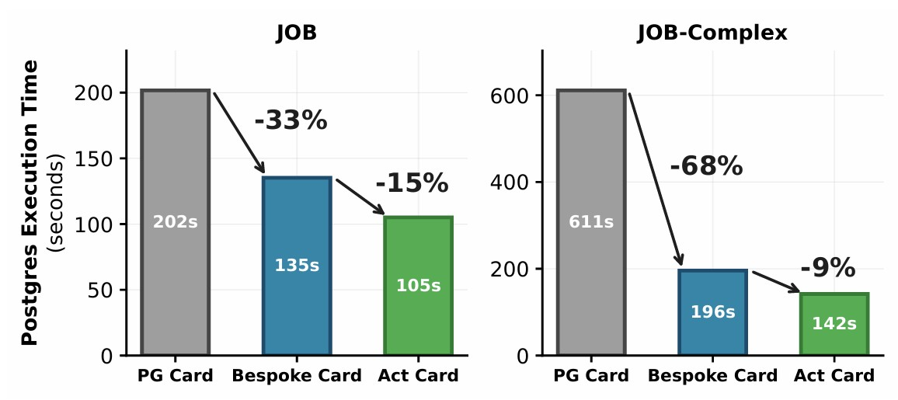

[](https://www.python.org/downloads/)
[](LICENSE)
[](https://github.com/astral-sh/uv)
[](https://github.com/astral-sh/ruff)
[]()

# Bespoke-Card

Source code of the paper *Bespoke-Card: Why Tune When You Can Generate? Synthesizing Workload-Specific Cardinality Estimators*

**Authors:** Johannes Wehrstein, Anton Winter, Timo Eckmann, Carsten Binnig

> **Status:** under submission

<div align="center">
    <figure>
        
        <p><em>End-to-end PostgreSQL execution time with PostgreSQL's estimator (PG Card), the synthesized Bespoke-Card estimator, and perfect cardinalities (Act Card). Bespoke-Card reduces runtimes by 33% (JOB) and 68% (JOB-Complex), closing most of the gap to perfect cardinalities.</em></p>
    </figure>
</div>

---

## Overview

**Bespoke-Card synthesizes workload-specific cardinality estimators as executable code**, replacing generic statistics and fixed learned models with compact, tailored artifacts. Instead of *tuning* a general-purpose estimator, it *generates* a new one specialized to a concrete schema and workload.

It uses an iterative **planner–coder loop** guided by a **deterministic evaluator** to design statistics, implement estimation logic, and repair errors using structured q-error feedback across join, filter, and full-subplan stages. By specializing to a concrete schema and workload, the approach captures correlations and predicate patterns that general-purpose estimators typically miss.

Experiments on **JOB** and **JOB-Complex** show substantial accuracy gains and **33%–68% reductions in end-to-end PostgreSQL runtimes**, approaching the performance of perfect cardinalities. The resulting estimators are **interpretable, lightweight, and can be synthesized in under an hour at low cost**.

## How It Works

Bespoke-Card drives two cooperating LLM agents through a closed loop:

1. **Planning agent** — queries the database to analyze data distributions, correlations, and predicate patterns, then designs a statistics strategy (`outputs/statistics_plan.txt`).
2. **Coding agent** — implements the plan as an executable estimator (`card_estimator.py`), then iteratively refines it across stages: initial setup → join accuracy → filter accuracy → combined final.
3. **Deterministic evaluator** — runs the candidate estimator over pre-generated subplans, computes q-error metrics against true cardinalities, and feeds structured errors back to the coding agent for targeted repair.
4. **Best-run selection** — the planner reviews all iteration feedback and selects the strongest implementation.

The synthesized estimator subclasses a common interface and implements two methods:

- `setup(self)` — load data and compute statistics.
- `estimate(self, tables, filters, joins) -> int` — return an estimated cardinality.

## Prerequisites

- Linux / macOS
- Python 3.12+
- [`uv`](https://github.com/astral-sh/uv) package manager
- A DuckDB build of the IMDB database and the IMDB CSV tables (see *Prepare data* below)

## Installation

### 1. Install uv

```bash
curl -LsSf https://astral.sh/uv/install.sh | sh
```

### 2. Install Python dependencies

```bash
uv sync
```

### 3. Configure environment

Create a `.env` file in the project root:

```bash
OPENAI_API_KEY=...        # for GPT models (OpenAI Responses API)
ANTHROPIC_API_KEY=...     # for Anthropic models (via LiteLLM)

# Optional — for local or custom LLM endpoints
# LLM_API_BASE=...
# OPENAI_API_BASE=...
# LITELLM_API_BASE=...
```

### 4. Prepare data

Provision the read-only DuckDB database at `data/imdb.duckdb` and place the IMDB CSV tables in the directory referenced by `TABLES_PATH`. Precomputed statistics (`data/row_counts.json`, `data/unique_vals.json`) and the schema (`data/schema.json` / `data/schema.sql`) are included in the repository.

## Usage

```bash
# Run the full pipeline: subplan generation → plan → code → evaluate → optimize
uv run python main.py

# Run only the agent loop (skips subplan generation)
uv run python agents.py
```

Synthesis produces a `card_estimator.py` artifact, the statistics plan in `outputs/`, and q-error feedback in `outputs/feedback.json`. Each agent interaction is logged to `.logs/<timestamp>/` together with a plot of q-error across optimization iterations.

## Architecture

### Agent pipeline (`agents.py` / `main.py`)

`coding_loop()` orchestrates the planner → coder → evaluate → select workflow. Both agents are instances of `OpenAIAgentsSDKWrapper`, which wraps the [OpenAI Agents SDK](https://github.com/openai/openai-agents-python).

### Model routing (`utils/model_setup.py`)

- Model names starting with `gpt-` use the native OpenAI Responses API (`CachedOpenAIResponsesModel`).
- All other models (e.g. `anthropic/claude-sonnet-4-6`) are routed through LiteLLM (`CachedLitellmModel`).

Both wrappers support disk caching of requests/responses under `cache/`. The `stop_on_cache_miss` flag enables deterministic replays against a pre-populated cache for reproducibility.

### Agent tools

- **Coding agent** — `apply_patch` (edit `card_estimator.py`), `shell` (read-only: `ls`/`cat`/`sed`/`head`/`tail`/`wc`), `evaluate` (run the evaluator subprocess), `ask_agent` (escalate to the planner).
- **Planning agent** — `query_db` (read-only DuckDB queries against `data/imdb.duckdb`).

### Evaluation flow

Subplans are pre-generated by `utils/subplan_generation.py` from `data/orig_queries.sql` and stored in `outputs/job_subplans.json` with true cardinalities (DuckDB) and PostgreSQL estimates. The evaluator annotates these subplans with the bespoke estimator's predictions and computes q-error metrics for the agent to act on.

### Synthesized estimators (`synthesized_card_estimators/`)

Hand-crafted reference estimators (`job.py`, `job_complex.py`) implement the same interface and serve as benchmarks. They use sampling, top-k frequency dictionaries, and join-graph logic.

## Repository Layout

| Path                            | Description                                                            |
|---------------------------------|------------------------------------------------------------------------|
| `main.py` / `agents.py`         | Entry points for the full pipeline and the agent loop.                 |
| `agents_sdk/`                   | OpenAI Agents SDK wrappers, LLM caching, and model definitions.        |
| `utils/`                        | Subplan generation, evaluation, metrics, tools, and plotting.          |
| `synthesized_card_estimators/`  | Reference estimators and the shared estimator interface.               |
| `prompts/`                      | Planner and coder prompt templates.                                    |
| `data/`                         | IMDB schema, queries, and precomputed statistics.                      |

## Citation

If you use Bespoke-Card in your research, please cite:

```bibtex
@misc{wehrstein2026bespokecard,
  title  = {Bespoke-Card: Why Tune When You Can Generate? Synthesizing Workload-Specific Cardinality Estimators},
  author = {Wehrstein, Johannes and Winter, Anton and Eckmann, Timo and Binnig, Carsten},
  year   = {2026},
  note   = {Under submission}
}
```

## License

Released under the [Apache 2.0](LICENSE) license.
